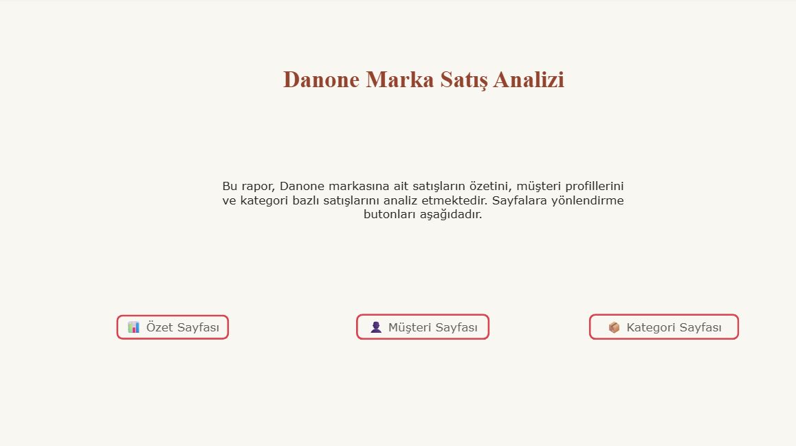
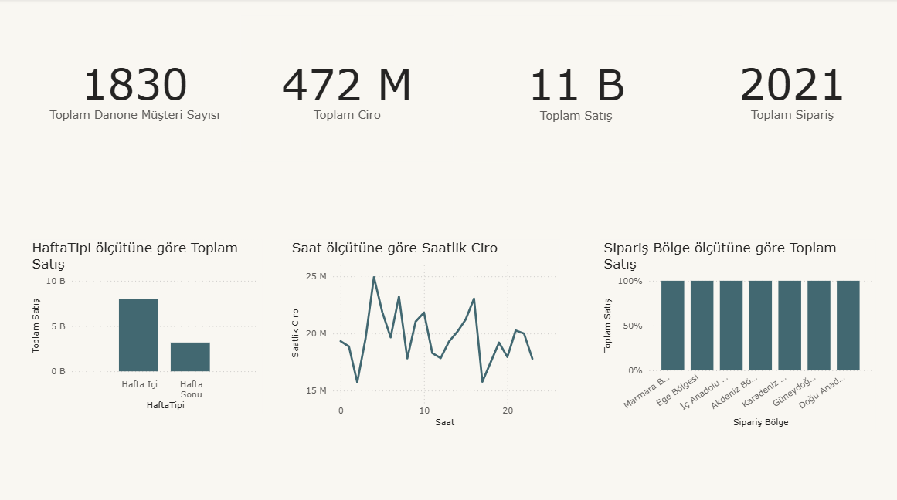
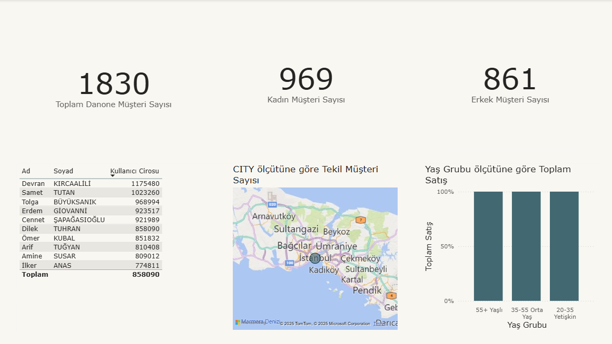
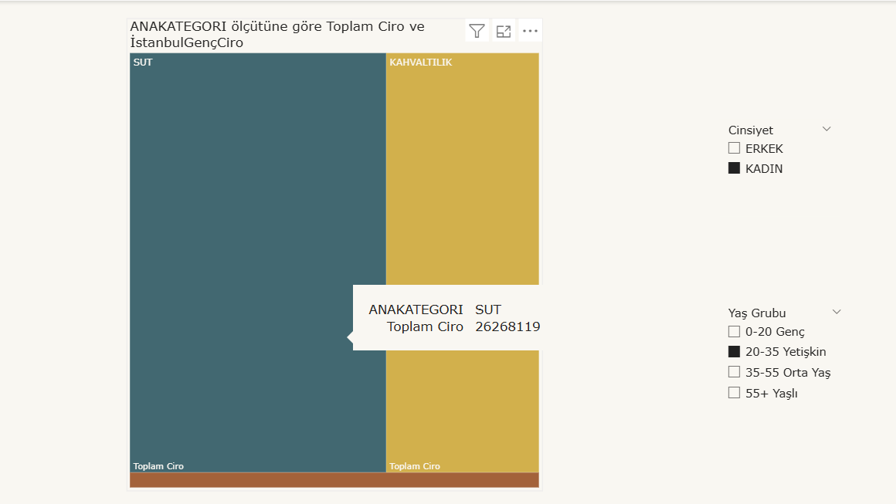

## DANONE Power BI Satış Analizi Projesi

### 📌 Proje Amacı

Bu projenin amacı, Danone markasına ait satış verilerini analiz ederek kullanıcı, ürün ve kategori bazında içgörüler elde etmektir. Power BI kullanılarak yapılan bu analiz, görsel destekli karar alma süreçlerine katkı sağlamayı hedeflemektedir.

### 🗃️ Kullanılan Veriler

| Tablo Adı         | İçerik                                   |
|-------------------|-------------------------------------------|
| `kullanıcılar`    | Müşteri bilgileri (yaş, cinsiyet, şehir)  |
| `siparis`         | Sipariş bilgileri (tarih, adres, müşteri) |
| `siparisdetay`    | Ürün ve miktar bilgileri                  |
| `ürünler`         | Ürün kataloğu (marka, kategori, fiyat)    |
| `adres`           | Şehir ve konum bilgileri                  |
| `bölgeler`        | Şehir-bölge eşlemesi                     |

### 🛠️ Modelleme

Veri modelinde aşağıdaki ilişkiler kurulmuştur:
 - siparisdetay[ITEMID] → items[ITEMID]
 - siparisdetay[SIPARISID] → siparis[SIPARISID]
 - siparis[KULLANICIID] → kullanıcılar[KULLANICIID]
 - kullanıcılar[ADRESID] → adres[ADRESID]
 - adres[SEHIR] → şehir_bölge[SEHIR]

### 🧠 Uygulanan Dönüşümler

- Doğum tarihinden yaş ve yaş grubu hesaplandı
- Cinsiyet, isim sütunundan çıkarıldı
- Tarih kolonundan saat ve hafta tipi bilgisi ayrıldı
- İstanbul’da oturan genç müşteri grubu filtrelendi
- Tablolar arası modelleme (birden çoğa ilişkiler) kuruldu
- Gereksiz kolonlar kaldırıldı (`CREATEDDATE`, `TELNR2` vb.)

### 📊 Kullanılan DAX Ölçüleri
Projedeki temel ölçüler sadece Danone markası için filtrelenmiştir:
 - Danone_Toplam_Satis_Adeti
 - Danone_Toplam_Ciro
 - Danone_Toplam_Musteri_Sayisi
 - Danone_Toplam_Siparis_Sayisi
 - Danone_Kadin_Sayisi
 - Danone_Erkek_Sayisi
 - Danone_Genc_Ciro
 - Danone_Bolge_Satis_Grafik
Ek olarak müşteri başına ciro, ortalama sipariş tutarı, saatlik satış gibi hesaplamalar da yapılmıştır.

### 📊 Sayfa Yapısı

| Sayfa | İçerik |
|-------|--------|
| **Giriş** | Rapor başlığı, sayfa geçiş butonları  |
| **Özet** | Haftaiçi/sonu satış grafiği, saatlik satış, toplam ölçüler  |
| **Müşteri Perspektifi** | Kadın/erkek sayısı, yaş grubuna göre satış, top 10 müşteri  |
| **Kategori Perspektifi** | İstanbul + Genç grubunun cirosu → kategori bazlı ağaç haritası  |

## 📌 Rapor Özeti

Danone markasına özel yapılan analizler sonucunda şu temel bulgulara ulaşılmıştır:

 ### 👥 Müşteri Profili ve Demografi Analizi
En çok alışveriş yapan yaş grubu 20–35 yaş aralığındaki yetişkin kadınlar olarak öne çıkmaktadır.

Danone ürünlerini tercih eden kadın müşterilerin oranı, erkek müşterilere kıyasla daha yüksektir.

Özellikle İstanbul, İzmir ve Ankara gibi büyük şehirlerde kadın müşteri yoğunluğu belirgin şekilde fazladır.

### 🌍 Bölgesel Satış Dağılımı
- Satışların büyük çoğunluğu Marmara ve Ege bölgelerinde yoğunlaşmaktadır.

- İstanbul, Danone satışlarının açık ara lideri konumundadır.

- İç Anadolu ve Karadeniz bölgelerinde ise satışlar görece daha düşüktür.

### ⏱️ Zamana Bağlı Satış Dinamikleri
- Saatlik analiz sonucunda öğle saatleri (12:00–14:00) arasında satışlarda belirgin bir artış gözlemlenmiştir.

- Haftanın günlerine göre incelendiğinde, cumartesi ve pazar günleri satış hacminin zirve yaptığı tespit edilmiştir.

- Bu durum, Danone ürünlerinin genellikle hafta sonu alışverişleri sırasında tercih edildiğini göstermektedir.

### 🛒 Kategori Tercihleri ve Alım Davranışı
- Genç yaş grubundaki müşteriler arasında en çok tercih edilen ürün kategorileri; yoğurt, süt ve içecekler olarak sıralanmıştır.

- Ağaç haritası analizi, özellikle İstanbul’da yaşayan genç müşterilerin içecek ve süt ürünlerine yüksek talep gösterdiğini ortaya koymuştur.

- Ortalama sipariş tutarı, Danone markasında genel ortalamanın biraz üzerinde seyretmiştir.

##📌 Genel Değerlendirme

- Danone markası, özellikle büyük şehirlerde yaşayan genç ve kadın müşteriler tarafından sıkça tercih edilmektedir.
- Satışların zamansal ve demografik yoğunluğu, markanın pazarlama stratejilerinde hedef kitle odaklı kampanyalar oluşturmasına zemin hazırlamaktadır.

- Bu analizler, markanın satışlarını artırmak ve müşteri deneyimini geliştirmek için önemli veri temelli içgörüler sunmaktadır.

- Power BI sayesinde bu veriler görselleştirilmiş, anlamlı hale getirilmiş ve stratejik karar alma süreçleri için etkili hale getirilmiştir.

  > Not: .pbix dosyası GitHub üzerinde büyük olduğu için görüntülenememektedir. Lütfen indirip Power BI Desktop ile açınız.

### ✨ Hazırlayan

**Fatma Kala**  
Power BI Bootcamp – Bitirme Projesi  
Temmuz 2025

